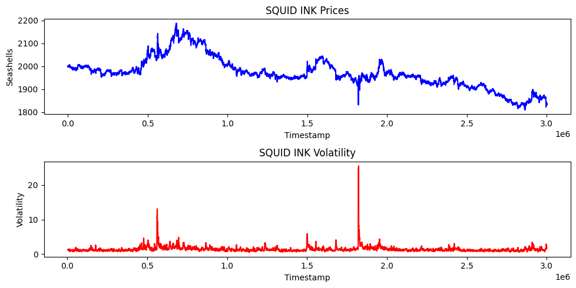

# CMU Physics 🐚🐚🐚 
This repo documents our research, strategy development and tools for **Prosperity 3 (2025)**, with ~12,000 teams we finished 7th Globally & 1st USA.

 

## 📜 What is Prosperity?

Prosperity is a 15-day long trading competition where players earn "seashells" to grow their "archipelago" in 5 rounds (each 3 days long). Each round new products are introduced that each have their own unique properties resembling real world tradable assets; you can always trade products from previous rounds so it's a game of finding alpha and optimizing previous strategies. To trade these products we researched the products (using provided sample data) then wrote and submitted a python file that performed systematic trades. Every round also had a manual trading aspect to it these challenges were typically centered around game theory decisions and had us playing around other participants' choices. 

At the end of each round, the algorithmic trading scripts and manual trading challenges were evaluated and added to our islands' PNL.

[Prosperity 3 Wiki](https://imc-prosperity.notion.site/Prosperity-3-Wiki-19ee8453a09380529731c4e6fb697ea4)

 

## 👥 The Team
| Christopher Berman | [@chrispyroberts](https://github.com/chrispyroberts) |

| Nirav Koley | [@n-kly](https://github.com/n-kly) |

| Aditya Dabeer | [@Aditya-Dabeer](https://github.com/Aditya-Dabeer) |

| Timur Takhtarov | [@timtakcs](https://github.com/timtakcs) | 

 

## 🗂 Repo Structure
Our code is split into the rounds that they were built for, all of the EDA, research, manual, and trader code is located within them.

Good luck parsing it, things got a little scrappy near the end...

 

## 🧠 What you're probably here for

Below are descriptions for both our algorithmic and manual trading strategies. We tried to play things safe and focused on market neutral strategies (straight line pnl)

<h2>Round 1</h2>

  
<h3>Algo</h3>

Round 1 introduced 3 new products: Rainforest Resin, Kelp, and Squid Ink. All of these products were relatively distinct but traded like stocks would in the real world -- nothing fancy just an order book and market price.

Rainforest Resin was by far the easiest product to trade, and probably one of the most consistently profitable across the entire competition. The sample data revealed that the fair value hovered exactly around 10,000 seashells, with almost no drift and extremely low volatility (typically deviating by no more than ±4 seashells). Market taking was straightforward: any time there was a bid above 10,000 or an ask below 10,000, we would immediately execute against it. On top of that, the order book had relatively wide spreads, which opened up market making opportunities by posting liquidity just inside the standing bids and asks. One thing we noticed was that there were often bids and asks in the order book at exactly the fair value. We used these orders to our advantage by checking if taking them would reduce our overall position and better balancing our market making and taking position. This small addition boosted our PNL performance quite a bit as often we were fully long or fully short Resin due to the volume of orders.

Kelp was a little more complicated. It displayed some mild price drift and a small but noticeable amount of volatility, making it dangerous to blindly market take at a fixed value. We noticed that there was another market maker always present in the order book, and found that on submission to the website our PNL was calculated based on the mid price of this market participant. This told us that the fair value at any given moment was the mid-price of their market. We copied our market making stratey from resin using this mechanic as the fair value. Because Kelp had such low volatility, often only moving a total of 40 seashells over the course of 10,000 steps, we didn't incoporate any directional aspect as simply market making and taking made so much more.

Then came Squid Ink, which was basically trading meme-coins, with consistent 100 seashells swings in a single step and seemingly no clear pattern. The IMC parrot kept hinting that “there’s a pattern if you look closely,” but to be honest, we don't believe any real exploitable structure existed. We tested a variety of strategies, including rolling z-scores, volatility breakouts, and MACD signals, but none offered any consistent edge. Employing the same market making and taking strategy as Kelp and Resin proved useful, since we found the same mechanic present for squid ink as we did for Kelp, but the massive spikes in price that appeared randomly would either instantly double take away any PNL we had made for the day. We decided to take a gamble on this and see what would happen on the submission day. 

<h3>Manual</h3>

BLAH BLAH BLAH

 

First round results were kind of controversial, it was kind of obvious that the round 1 data on the website was actual price history for the first 1000 timestamps on day 1 (instead of 1000 time stamps from previous test days) so a bunch of people ended up hardcoding in their trades on the first 1000 timestamps. This combined with squid ink spiking in the opposite direction as our market making position, meant we actually lost seashells off squid ink and ended up in 771'st place. However, the round was re-run due to the hard-coding being considered cheating and we shot up to 9th place with a total PNL of 107,237 seashells (43,243 algo + 44,340 manual). We got incredibly lucky on the re-run because squid ink spiked in our favor rather than agaisnt it.  The top 3 teams seemed to have some how found something out, that meant they were ~100k seashells ahead of everyone else, but between us and 4th place was only a couple thousand seashells. 

---

<h2>Round 2</h2>

Going into round 2, we were pretty confident about everything and had high hopes that we could break into top 5.

 
  
<h3>Algo</h3>

<h3>Manual</h3>

BLAH BLAH BLAH

 

Once again, these results were quite controversial. It seems like the data from a previous Prosperity competition was strikingly similiar (exact same) as one of the products this round. This meant that anyone who had the old price data had a perfect predictor for current prices. Only 2 teams found this though (they had millions of seashells at this point) but the admins once again decided to strike these people down. Ultimately after the hardcoders were smited we were in 7th place w/ a total PNL of 243,083 (165,656 algo + 77,427 manual).

---

<h2>Round 3</h2>

Thoughts going in

 
  
<h3>Algo</h3>

BLAH BLAH BLAH
<h3>Manual</h3>

BLAH BLAH BLAH

 

Results

---

<h2>Round 4</h2>

Thoughts going in

 
  
<h3>Algo</h3>

BLAH BLAH BLAH
<h3>Manual</h3>

BLAH BLAH BLAH

 

Results

---

<h2>Round 5</h2>

Thoughts going in

 
  
<h3>Algo</h3>

BLAH BLAH BLAH
<h3>Manual</h3>

BLAH BLAH BLAH

 

Results

---

## 🏁 Final Thoughts
Something philosophical
