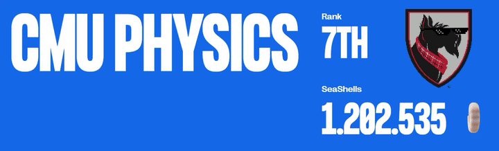

# CMU Physics 🐚🐚🐚 
This repo documents our research, strategy development and tools for **Prosperity 3 (2025)**, with ~12,000 teams we finished 7th Globally & 1st USA.

 

## 📜 What is Prosperity?

Prosperity is a 15-day trading competition where players earn "seashells" to grow their "archipelago" across 5 rounds (each lasting 3 days). Each round introduces new products with unique properties resembling real-world assets; products from previous rounds remain tradable, making it a game of finding alpha and optimizing strategies.

We researched each product using sample data, then wrote and submitted Python scripts to perform systematic trades. Each round also included a manual trading challenge, typically centered around game theory and predicting other participants' decisions.

At the end of each round, both algorithmic and manual results were combined into our island's PNL.

[Prosperity 3 Wiki](https://imc-prosperity.notion.site/Prosperity-3-Wiki-19ee8453a09380529731c4e6fb697ea4)

 

## 👥 The Team
| Chris Berman | [@chrispyroberts](https://github.com/chrispyroberts) |

| Nirav Koley | [@n-kly](https://github.com/n-kly) |

| Aditya Dabeer | [@Aditya-Dabeer](https://github.com/Aditya-Dabeer) |

| Timur Takhtarov | [@timtakcs](https://github.com/timtakcs) | 

 

## 🗂 Repo Structure
Each round has its own folder, containing all our EDA, research, manual trading solutions, and algorithmic strategies.

It started out organized... then the 4 a.m. coding sessions happened. Good luck!

 

## 🧠 What you're probably here for

Here’s a breakdown of our algorithmic and manual strategies. Our overall approach focused on market-neutral plays (straight-line PNL, no crazy bets).

<h2>Round 1</h2>

  
<h3>Algo</h3>

Round 1 introduced 3 new products: Rainforest Resin, Kelp, and Squid Ink. All of these products were relatively distinct but traded like stocks would in the real world -- nothing fancy just an order book and market price.

Round 1 introduced three new products: Rainforest Resin, Kelp, and Squid Ink — all traded like real-world stocks with basic order books and market prices.

- Rainforest Resin was the easiest and most consistent to trade. The fair value hovered around 10,000 seashells with almost no drift ($\pm$4 seashells). We market took anytime bids were above 10,000 or asks below 10,000, and market made inside the spread. Additionally, we exploited standing orders exactly at fair value to better balance our long/short positions, significantly boosting our PNL.

- Kelp was trickier, showing mild drift and volatility. We found a persistent market maker whose mid-price effectively defined the real-time fair value, and confirmed this by submitting an order to buy 1 kelp and holding until the end of the day comparing the final PNL to our buy price. Using this mid-price, we applied the same market making/taking strategy as Resin, without adding any directional bias given the low volatility (~40 seashells over 10,000 steps).

- Squid Ink was pure chaos — with regular 100 seashell swings within a single step and no obvious structure despite IMC’s hints. We tested rolling z-scores, volatility breakouts, and MACD signals without finding any consistent edge. Ultimately, we reused the Kelp/Resin strategy here, but due to random massive price spikes, PNL was extremely volatile. We chose to gamble and submit as-is for Round 1.

<h3>Manual</h3>
  
This manual was pretty simple, it was a currency exchange problem were it was possible to exchange currencies in a way to profit of of it. All we had to do was a breadth first search across all possible currency conversions.

See [Leetcode 3387. Maximize Amount After Two Days of Conversions](https://leetcode.com/problems/maximize-amount-after-two-days-of-conversions/description/).

<h3>Results and Post-Round Analysis</h3>

First-round results were controversial. It became clear the website’s "sample data" was actually the first 1000 timestamps of live day 1 data, allowing teams to hardcode trades. Combined with Squid Ink spiking against our market making position, **we initially finished 771st.**

**After the round was re-run (hardcoding was ruled cheating), we shot up to 9th place** with a total PNL of 107,237 seashells (43,243 algo + 44,340 manual). We got lucky on the re-run — Squid Ink spiked in our favor instead of against us. The top 3 teams still finished ~100k seashells ahead of everyone else, but we were within a few thousand seashells of 4th.

Afterward, we decided Squid Ink was too volatile for full-size market making. We adapted by only allocating 10% of our position to it, cutting PNL by about 50%, but added a spike detection system:

- We used a rolling standard deviation on price differences.

- If the rolling std > 20, we fully entered a position opposite to the recent price move.

This adjustment made Squid Ink PNL much more stable across all days.

---

<h2>Round 2</h2>

  
<h3>Algo</h3>
Round 2 introduced new products: CROISSANTS, JAMS, DJEMBES, PICNIC_BASKET1, and PICNIC_BASKET2.

- PICNIC_BASKET1 contained 6 Croissants, 3 Jams, and 1 Djembe.

- PICNIC_BASKET2 contained 4 Croissants and 2 Jams.

We recognized the structure from previous years and analyzed the price difference between each basket and its components. The basket premiums appeared mean-reverting, so we hard-coded the mean from bottle data, used a short rolling window for standard deviation, and calculated rolling z-scores:

- When z-score > 20, we shorted the basket and longed the constituents.

- When z-score < -20, we did the opposite.

This hedging isolated and traded the basket premium directly.

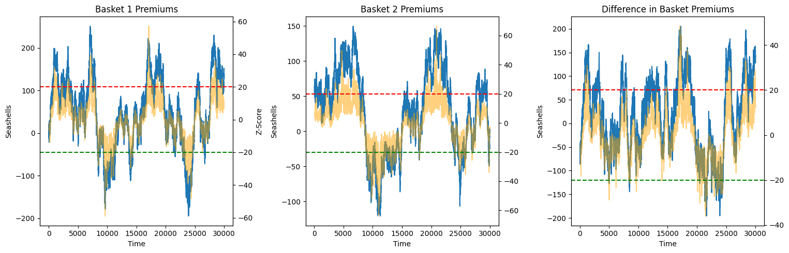

We ran into a problem with this though. The position limits prevented fully hedging both baskets simultaneously. To fix this, we did a few things

- We focused on the difference in basket premiums between Basket 1 and Basket 2.

- Used the z-score (Basket1 premium - Basket2 premium) as entry and exits, using the same 20 and -20 scores for entry/exits, then hedging accordingly.

Using this strategy used the following of our position limits:

- 100% of Basket 1’s position limit,

- 60% of Basket 2’s limit.

We did z-score trading with the remaining 40% of position limit on Basket 2, but had to limit it to 32% because we couldn't perfectly hedge due to position limits on the constituents. The remaining 8% of Basket 2’s position limit was unused — so we deployed it by market making (taking advantage of ~7–10 seashell spreads).

Overall, this strategy allowed us to fully utilize 100% of allowed position limits while minimizing unhedged risk.
Market making with the leftover 8% added ~5k seashells/day in backtests with very low volatility.

Chris also spotted suspicious trade quantity 15 patterns at highs/lows for Squid Ink and Croissants — hinting at potential price signals. However, it was too late to build a reliable strategy around them, so we planned to revisit this idea in Round 5.

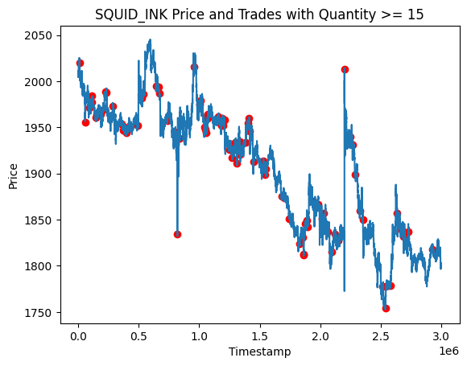

<h3>Manual</h3>

This round’s manual was particularly interesting: we could select up to two out of ten shipping containers, each with different multipliers and inhabitants. Profit from a container depended not just on its multiplier, but also on how many players picked it:

> PNL = (10,000 × Multiplier) / (Number of inhabitants + % of total selections that picked this container)

The first container choice was free, but opening a second cost 50,000 SeaShells. We built a simpler greedy Monte Carlo that converged to a Nash equilbrium for selection rates across all containers.

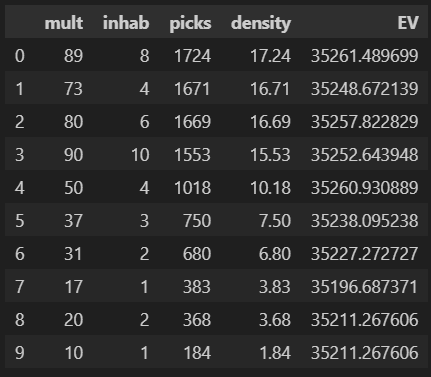

When we ran the numbers, we found that the Nash equilibrium values for the containers were consistently below 50,000 SeaShells meaning that opening a second container would almost always be a losing play. From this point on, we decided to only focus on selecting one container, believing that hedging across two was too risky given the low payouts.

On top of the Nash equilibrium strategy, we built a set of priors based on how we thought players would actually behave, the goal with these assumptions was to try and price in how people might act (beyond just following the nash). These alternative strategies ranged a lot from just random selection to phsycolgoical bias (the number 7 & 3 are well-documented to be more 'likeable' to humans and thus picked more frequently when asked to pick a number from 1-10)  Our hypothesis was that:

- 15% of players would play according to Nash equilibrium,
- 50% would choose randomly,
- 20% would gravitate toward “nice numbers” (multipliers like 73, 17, and 37),
- 10% would misread the prompt and simply pick based on initial EV,
- and 5% would follow the flawed Monte Carlo strategy we had initially come up with.

We re-ran a new Monte Carlo simulation based on these priors and recalculated the EVs of all the containers, aiming to account for both rational and irrational human actors. Ultiamtely we chose to only pick the 80x crate (this was a bad idea).

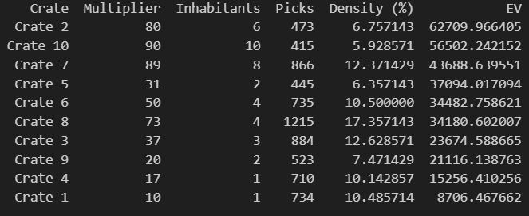

<h3>Results and Post-Round Analysis</h3>

Once again, the results were quite controversial. Some teams discovered that the timestamps when bots would trade were exactly the same as the previous year. This meant teams could predict when buy and sell orders would be filled, allowing them to wipe out the entire bid/ask side of an order book, place their own orders above or below, and have them instantly filled — leading to millions in profit per round.

In our opinion (and many others’), this was unfair and not in the spirit of the competition. While only two teams exploited this (they had millions of seashells by this point), the admins decided to disallow this form of hardcoding. After reviewing the code of many teams in the top 25, they asked teams suspected of using this advantage to submit updated versions of their algorithms without the hardcoded behavior, causing several teams to drop significantly on the leaderboard.

As for us, **we moved up to 7th place** with 243,083 seashells, making 102,758 from our algo and 33,087 from the manual.

Looking back on the manual, we definitely underestimated how many players would stick close to Nash equilibrium and overestimated the randomness in player behavior. Additionally, our simulation didn’t properly account for the impact of the "nice numbers" category, leading us to overweight the likelihood of truly random selections. These misjudgments probably contributed the most to our lower ranking in the manual portion of the tournament.

However, it wasn’t a total loss — we took the lessons from this round, updated our priors accordingly, and built a much stronger player modeling system for future decision-based rounds.

<h2>Round 3</h2>

<h3>Algo</h3>

This round introduced six new products: Volcanic Rocks and five different Volcanic Rock vouchers with strike prices of 9500, 9750, 10000, 10250, and 10500. These products closely resembled European option contracts and were set to expire in 7 in-game trading days.

Chris handled the analysis for this round. Using a hint provided on the website, he modeled the volatility smile by plotting the moneyness $m_t$ against the implied volatility $v_t$. Moneyness was calculated using the formula: Moneyness was calculated using the following formula $$m_t = log(K / S_t) / \sqrt(TTE)$$ where $K$ is the voucher strike price, $S_t$ is the price of the underlying at some time $t$, and $TTE$ being the time to expiration in years. 

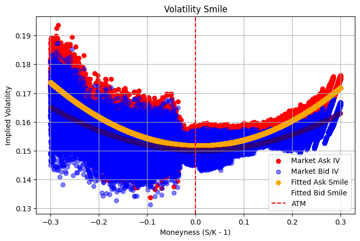

Fitting a quadtratic to this we found parameters $a, b, c$ for the equation $$v_t = a \cdot m_t^2 + b \cdot m_t + c$$ allowed us to predict a "fair" implied volatility for any given $m_t$. After coding this up, we found the best way to exploit this was to build a market maker based on the fitted implied volatility. It was an extremely aggressive market maker and would often cross with existing market makers in the order book. We also added functionality to automatically hedge our positions after every timestamp, ensuring we were only exposed to the implied volatility of a contract.

Our backtesting PNL curve was a straight line on most days, indicating we had found a reasonable, direction-neutral strategy. We hypothesized that this was because we were modeling the true IV of the vouchers more accurately. From our backtests, we expected to make around ~80k from all voucher products and ~100k from other products.

A few other things we considered for algo trading this round:

- We analyzed how much we were losing in long voucher positions due to theta decay. Chris found that the vouchers had a maximum annualized theta decay of 800 seashells, meaning that holding a voucher for a year — assuming no changes to the underlying or voucher structure — would result in an 800 seashell loss. He estimated that if we were fully long 200 vouchers, the daily loss due to theta would be approximately 430 seashells:   
  $$
  \frac{800\ \text{seashells per year}}{365\ \text{days per year}} \times 1\ \text{day} \times 200\ \text{vouchers} \approx 430\ \text{seashells per day}
  $$ This loss was negligible compared to the 80k we were making in backtests.
  
- Since we could hold up to 400 Volcanic Rocks and 200 of any voucher, if we went long two different vouchers, we could at best fully hedge two of them assuming each had a delta of 1. To keep things manageable and avoid messy edge cases, we capped all voucher positions at 80. This guaranteed that we could always fully hedge, greatly simplifying our delta hedging logic and making the delta-neutral strategy easy to implement. There was probably a better way to optimize this, but given the time constraints of the challenge, we felt this was a favorable trade-off.

<h3>Manual</h3>
In this round, we had to place **two bids** to acquire **Sea Turtles' Flippers**. Each turtle accepted the **lowest bid above their reserve price**, where reserves were **uniformly distributed** between **160–200** and **250–320**.

For the second bid, a penalty applied if your offer was below the average of all second bids, scaling your profit by:

> $$ p = \left(\frac{320 – \text{average bid}}{320 – \text{your bid}}\right)^3 $$

All acquired Flippers could later be sold for 320 SeaShells each.

For this manual, we took a more systematic approach from the start. First, we isolated the one-bid scenari and ran a Monte Carlo simulation for every possible bid between 160 and 320.  
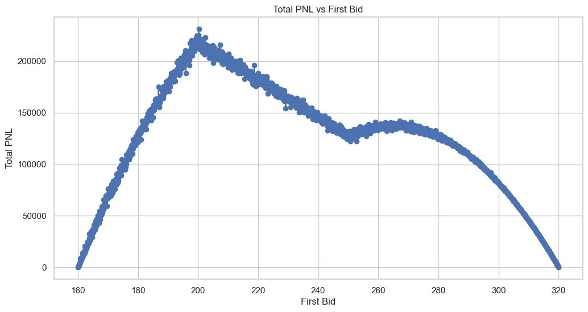

From this, we found that if we were limited to only one bid, it was clearly optimal to set it at 200 — just at the cutoff before the dead zone of 200–250.

Next, we tackled the two-bid scenario, initially ignoring the impact of the *p* scaling (i.e., assuming no penalty for being under the average second bid). We ran another Monte Carlo simulation where the first bid was fixed at 200, and the second bid varied across the full range from 160 to 320.  
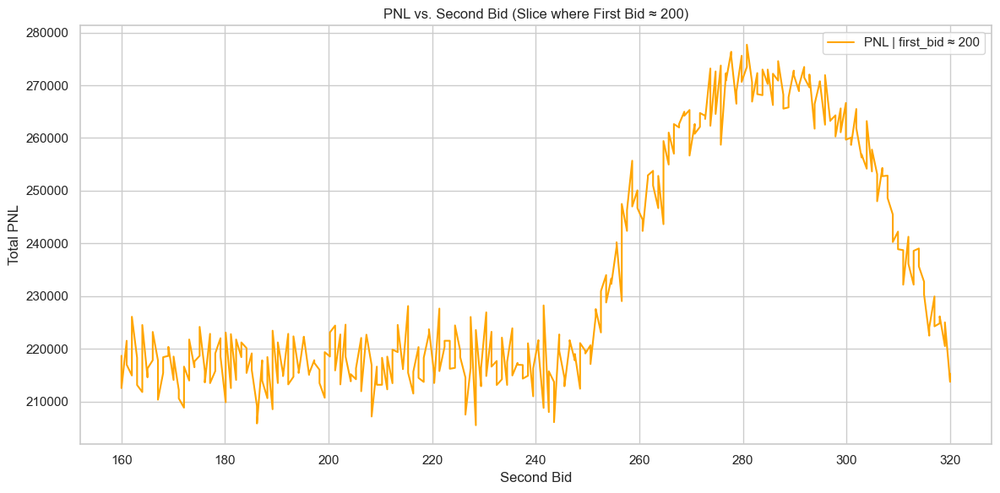

At this point, it became clear that picking 285 for the second bid was the Nash Equilibrium: if all players played optimally (GTO), they would pick 200 first and ~285 second, ensuring their second bid was just above the reserve range and staying above the average.

However, we realized that some players might attempt to undercut the average slightly — placing their second bids just above 285 to exploit players who bid exactly at Nash, thereby pushing their bids below the average and subjecting them to the *p* scaling penalty.

To account for this, we built a new set of priors, this time using continuous probability distributions rather than discrete categories (since bids could be any number within the range). Our assumptions were:

- 10% of players would play perfect Nash,
- 25% would concentrate around the optimal mid-point (tight Nash cluster),
- 49% would pick values slightly higher than the GTO price,
- 1% would pick completely randomly,
- 15% would intentionally grief (e.g., bots setting bids at 160 or 320 to skew the distribution, as discussed in Discord).

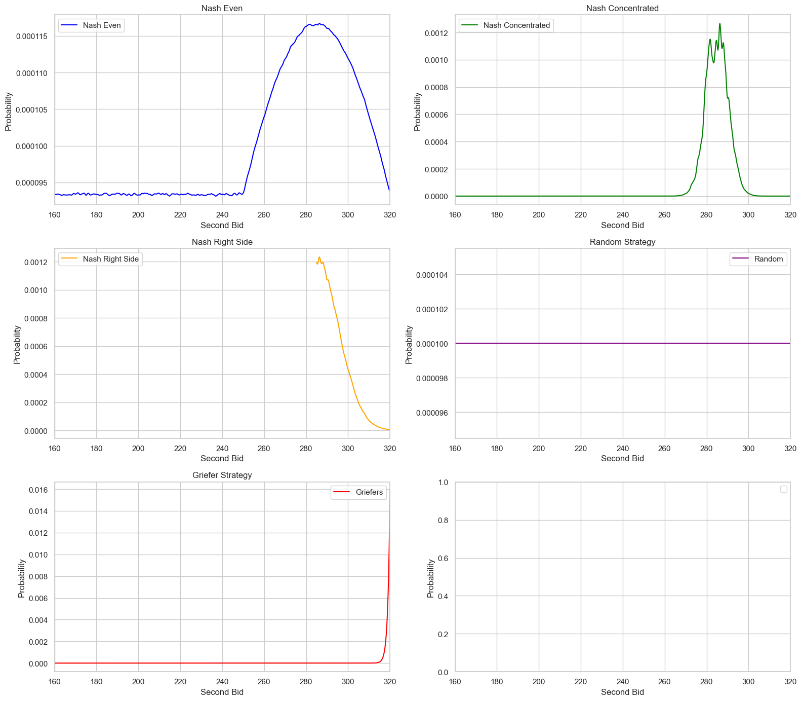

We then modeled these priors and re-simulated outcomes, finding that the **optimal second bid** was approximately **290** — slightly higher than the GTO point to hedge against players trying to outmaneuver Nash bidders.
 

<h3>Results and Post-Round Analyysis</h3>

The manual of this roudn turned out not so decent. The actual average second bid ended up being around 286, slightly higher than pure GTO but very much in line with our expectations. Looking at the resulting graphs, it was clear that most players aimed for Nash or slightly above it, confirming that our modeling approach and priors were pretty spot-on.

Overall though, this round was absolutely brutal for us as **we fell from 7th to 241st**, making us all believe that a comeback was impossible. We only made 75,755 on algo while many of the top teams made >200k on algo. We knew either something was wrong or we had missed something.

- We first realized that Jasper's visualizer, which we were using extensively, had an issue where it caused the algorithm on submission to exceed 100MB of memory, triggering a restart of the AWS Lambda instance. This meant all local variables our algorithm was using to trade were wiped and re-initialized. It broke key rolling windows that were critical for trade entries and hedges on basket and volcanic rock products, causing our trader to effectively buy and sell these products randomly. For future submissions, we decided to simply remove Jasper's visualizer rather than debug it.
  
- Chris then realized we had completely missed an extremely profitable trading strategy on volcanic vouchers. Our quadratic fit for implied volatility stopped being a good model on the submission day — it either severely under- or overestimated the IV the market was trading at. As a result, our trader would enter into a long or short IV position on a voucher and hold it all day. While IV did spike, the corresponding seashell gain was small, so we made almost nothing from volcanic rocks using the fitted model. In the figure below, Chris plotted the IV for bids and asks across different vouchers over time, along with a short rolling window of the mid IV. Using the mean of this rolling window instead of the quadratic fit as the fair IV model made our backtester PNL shoot up from 80k to 150k per day — even on the day of submission.

- Chris also ran some backtests to figure out how much our hedging was costing us. Since the order book for volcanic rock had a consistent spread of 1, every buy or sell effectively cost us 0.5 seashells. By counting the total trades taken while hedging, Chris found we were paying over 40k in spread costs just to hedge. This gave us the idea that we might not want to hedge at all.

- Chris estimated an upper bound for how much we could lose by being unhedged. At one point, volcanic rocks moved by 100 seashells in a single step, which — assuming a delta of 1 — would correspond to a maximum loss of 40k if holding 400 vouchers. Chris tracked our average delta exposure throughout the day and found it was closer to being long 160 units of the underlying, meaning the 40k estimate was very conservative. A more realistic maximum loss would be around 16k in a single step. Given that price movements appeared random (at least to us), and the potential upside from not hedging was greater than our realistic downside risk (40k > 16k), we decided that going unhedged was a risk worth taking. This boosted our backtester PNL on volcanic rock products to around 250k per day.

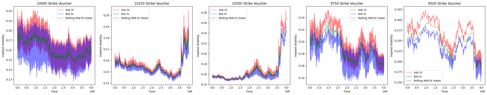

<h2>Round 4</h2>

 

After the disappointing algo results in Round 3, we felt defeated and were honestly ready to give up. Breaking into the top 25 — let alone the top 10 — seemed impossible from that position. Luckily, in Chris's opinion, this round was incredibly easy, as it was very similar to Round 2 from the previous year. His trading algo that year had landed him in 3rd place, so he was confident that re-implementing the same strategy would lead to strong results.
  
<h3>Algo</h3>

This round introduced a new product called Magnificent Macrons. Magnificent Macrons could be bought or sold on the local island and then converted on the Pristine Island (think buying BTC from one crypto exchange and selling it on another — same exact concept). However, when converting your position, you paid several fees: a transport cost, an export tariff (if converting a long position — like exporting from the main island), or an import tariff (if importing to the main island). On top of that, you paid a storage fee of 0.1 seashells per timestamp per Macron held, heavily encouraging players not to hold long positions.

While Macron prices were strongly correlated with `sugarPrice` and `sunlightIndex`, we decided to completely ignore these factors, since simply arbitraging across islands was far more profitable than trying to predict Macron price movements using a model.

- Because import tariffs were negative, we were effectively paid to sell on the local island and convert on the Pristine Island. To calculate the break-even price for selling a Macron, we used the formula:

  $$
  \text{sell\_local\_break\_even\_price} = \text{conversion\_ask} + \text{import\_tariff} + \text{transport\_fee}
  $$

- We also noticed there was a bot aggressively taking orders on the local island near the mid-price of the Pristine Island. We used this to our advantage by placing sell orders near the mid-price (if it was above our break-even price) and immediately converting them after they filled. We would pocket the difference between our sell price and the break-even price, multiplied by 10 (since we could convert 10 Macrons at a time).

- In backtests, Chris estimated a potential profit of up to 100k seashells from Macrons over the course of the day, depending on how negative the import tariffs were. We were happy with that, submitted, and went to bed.

<h3>Manual</h3>

In this round, players could open up to three suitcases containing prizes. Opening one suitcase was free, but opening a second or third required paying a fixed cost. 

Each suitcase had a prize multiplier (up to 100) and a known number of inhabitants already selecting it. Profit was calculated as:

> Profit = (10,000 × Multiplier) ÷ (Number of inhabitants + % of global suitcase selections)

Costs for opening additional suitcases applied after this division, making careful suitcase selection critical.

This challenge was nearly identical to Round 2, giving us a shot at redemption. We started strong by immediately calculating the Nash equilibrium across all suitcases.  
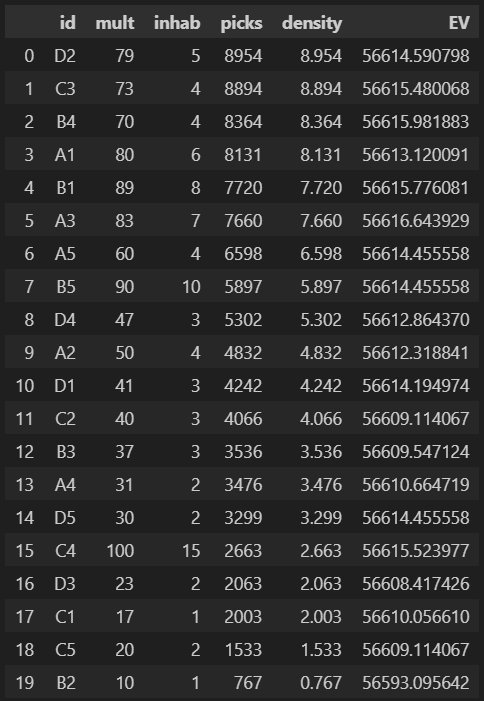

Since the Nash EV was greater than 50,000 (the cost of opening a second suitcase), we determined it was profitable to open two suitcases.

The real challenge came in modeling human behavior. Fortunately, players had shared post-analysis from Round 2 on Discord, showing how actual picks compared to Nash predictions.  
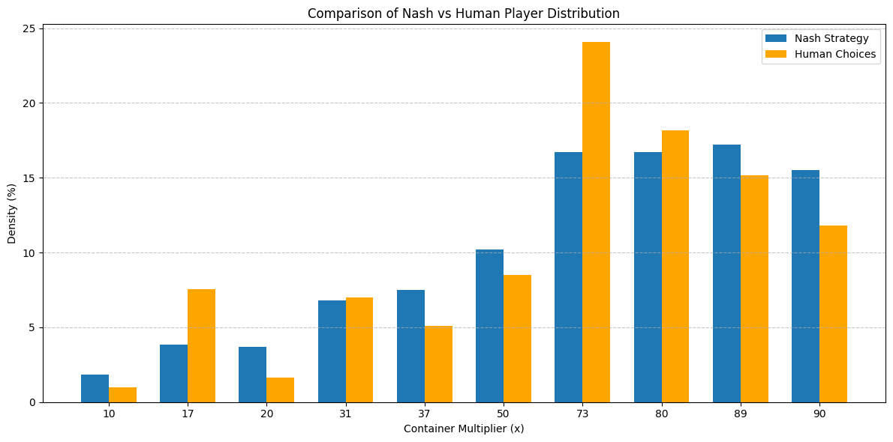

The findings were surprising:
- Way more players picked close to Nash than we had expected.
- There wasmassive buy pressure on "nice numbers" like 17 and 73, confirming our human psychology prior.
- Minor deviations elsewhere seemed due to random noise.

Based on this, we simplified and updated our priors:
- 50–60% of players would pick according to Nash distribution.
- 5–15% would concentrate on the most selected parts of Nash.
- 5–10% would favor the least selected parts (based on over-correcting from last round’s profitable crates).
- 10–15% would pick randomly.
- 10–15%* would favor "nice numbers" based on human psychology.

Rather than running another Monte Carlo simulation (since this was a discrete problem), we created a **probability distribution** directly across all suitcases. We multiplied base Nash probabilities by the expected deviations from our priors to estimate suitcase popularity mathematically.  
 
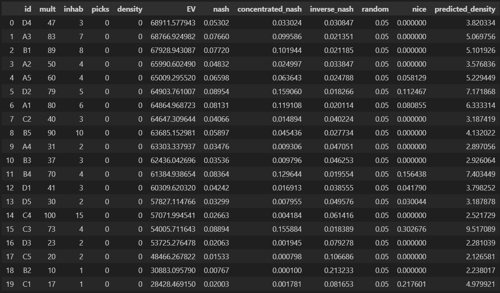 

Using this model, we selected suitcases 83 and 47 as our picks.
 

<h3>Results and Post-Round Analysis</h3>

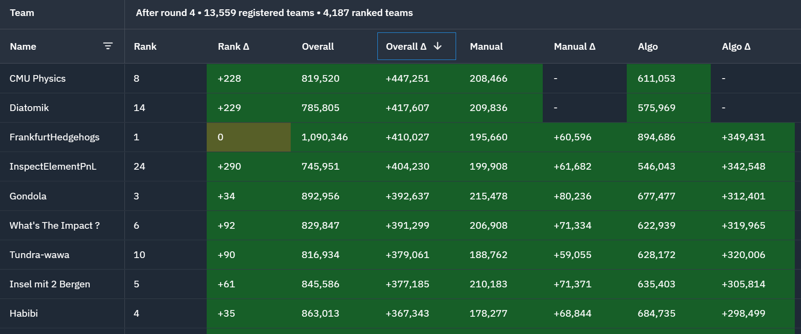

We woke up to a very pleasant surprise: **we were back in 8th!** Out of all teams this round, we had the highest PNL, making a whopping 447,251 seashells from our algo and manual combined!

This manual went extremely well for us. While we didn’t absolutely maximize profits, our approach paid off — our predicted densities were very close to the actual results, leading to strong EV predictions and a solid gain in ranking.  

We realized that if we hadn’t messed up Round 3, we would have been in second place overall. Based on our algo PNL, it was also clear that we had very similar trading strategies to the #1 team (Frankfurt Hedgehogs), making just slightly more than them while maintaining a very straight PNL curve. Combined with Chris’s backtests on our Round 3 submission — which again showed our algo PNL was very close to Frankfurt’s — we were pretty convinced that we had the same strategies as the #1 team.

After our emotions settled, Chris ran some backtests on Macron arbitrage and confirmed that around 100k of our PNL came from Macrons. He also found that out of the 10,000 steps in the submission, we only traded 56,000 Macrons. Because we only sent orders in sizes of 10, we estimated that we were only trading about half the time.

Since the import tariffs were very negative, we were making about ~3 seashells per Macron we arbed. By missing trades on roughly 4,400 timesteps, we effectively left 44,000 Macrons on the table — meaning we potentially left 132k seashells unrealized. Chris reasoned that on the timesteps when the aggressive buyer of Macrons wasn’t always there we would still want to convert Macrons in order to maximize PNL, so we would want a small stockpile of Macrons we were always short to take advantage of missed opportunities.

By adjusting to sell up to 30 Macrons at a time instead of 10, we traded 95,000 Macrons. This adjustment would lead to a net short position throughout the day, which we estimated could potentially result in a maximum loss of 30 × 400 = 12,000 seashells if the price moved against us (400 being the largest price movement we observed in the data). Given that we were nearly doubling the amount of Macrons we were arbitraging — and thus doubling our PNL — we decided that this risk was worth taking.

<h2>Round 5</h2>

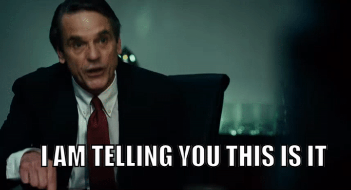

 
  
<h3>Algo</h3>
This round no new products were introduced. Instead, we were told the counterparties that we were trading agaisnt. Specifically, there were 11 other bots trading the same products we were. We started by visualizing all trading activity for all the bots, and plotted products prices and overlayed a scatter plot with the prices bots would trade at. We did this for all bots and all products, and quickly found that one bot, 'Olivia', would buy/sell and the low/high of the day every day on 3 different products.

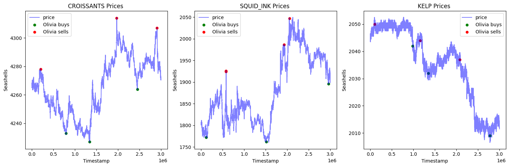

Chris had correctly guessed that the trades present in round 2 data did indeed have a true signal. Using this information, we planned to update our algorithms to copy Olivia's trades.

- After running some quick tests, we found that we were making more just market making and taking on kelp than using Olivia's signal, so we left our Kelp trading alone.

- For Squid Ink, we decided to market make and take with maximum position sizing until Olivia's signal, and then just follow it for the rest of the day.

- Croissants was slightly more complicated because we were using it as a hedge in our basket trades. We estimated that we were making ~30k per day by doing statistical arbitrage on the basket premiums. Because we had a true signal on croissants, Chris reasoned that we shouldn't take trades on baskets in the opposite direction of Olivia's signal, as the price of Croissants accounted for ~50% of the price of the basket.

  
- Building off this, we decided to YOLO into Croissants. Our maximum position size for Croissants was 250, but if we went long on both baskets, we could effectively be long 1050 Croissants. We estimated that on a bad trading day for this signal, the difference between the high and low on Croissants is 40 seashells, so a lower bound on our croissants PNL was 40 * our position size. Going long an extra 800 Croissants on this bad day will give us an extra 32k Seashells.

- Our statistical basket arbitrage was hitting 50k on it's best days, while YOLOing croissaints on Olivia's signal was getting up to 120k on its best day (difference of about ~120 between the high and low). We decided this was the best idea. Convinient that it was also very simple to implement.

- We hedged the baskets by going opposite on Jams and Djembes, as the movement of the basket was still about 50% correlated with these products. Our final position ended up being exposed to 30 Jams due to position limits. By taking on the extra 30 jams, we were able to go long another 60 croissants. We found that Jams would move on average 50 on their most volatile day, so the upside of the 60 Croissants was higher than the potential downside on Jams leading us to believe that this was a risk worth taking.

- We also realized we were exposed to the premium of the basket, and that in a near worst-case scenario, we could lose up to 300 seashells per basket we were holding if we bought at the top of premium then sold at the bottom or vice versa, meaning a total potential loss of up to 45,000 seashells due to premium movement agaisnt us while in our trade. We could not think of a way to reduce this risk.

- Chris found that with 90% confidence the difference in basket 2 premiums from one timestep to the next was stationary, and with 95% confidence for basket 1, so we reasoned that its a coinflip that premium will move agaisnt us, and the probability of us buying right as the series is mean reverting is incredibly low (assuming Olivia's signal is not correlated with the top/bottom of premiums). Because of this, we reasoned that our potential loss is most likely not 45,000 and more realistically 20,000 at most, and that in expectation our loss is 0. Based on this line of reasoning, we ultimately decided that this risk was worth taking. 

- One final optimization Chris made was that while waiting for Olivia's signal, we would market make and take on both picnic baskets since they both had large spreads. This made us an 10k seashells per day depending on how long we had to wait before Olivia's signal. 

<h3>Manual</h3>

For this round, we had to trade on 9 different products and derive sentiments from the 'goldberg' terminal. Trading was not only influenced by sentiment, but also incurred increasing fees based on how much of each product was purchased:

> Fee($x$) = $120 \times x^2$, where $x$ is the portfolio allocation fraction.

This made optimizing both selection and sizing critical to maximize profits.

At first, this round seemed purely vibe-based. However, after some thought, we realized it was actually a portfolio optimization problem in disguise.

The first step was to generate priors for how each product's price might move.  
Luckily, we found data online from previous years, and noticed that the tradeable products were almost identical to those offered this year. This allowed us to map historical returns onto current products. 

However, the instructions were vague — it was unclear whether price movements were purely player-driven or predetermined. To be cautious:
- We adjusted last year’s return data slightly based on sentiment from Discord and our own intuition.
- We used historical data mostly to estimate the range of possible movements rather than directly copying past results.
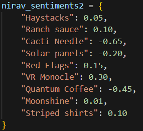 

Once we had reasonable return estimates, we tackled the portfolio allocation. With 9 products and the quadratic fee structure, it was clear that naive brute-force (e.g., a grid search) would be computationally impossible.

Instead, we used convex optimization (`cvxpy`) to solve for the optimal portfolio allocation, maximizing expected returns while minimizing fee penalties.

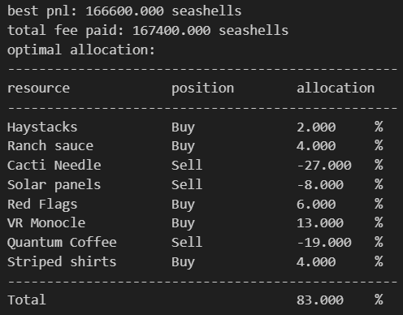 

We also decided to tone down the allocation weights slightly for higher-risk products to mitigate the chance of getting burned if our return estimates were wrong.

 

<h3>Results & Post-Round Analysis</h3>
**We finished 7th overall — and 1st in the US!** We were really happy with this result. Our algo made 244,740 seashells, and we made 138,274 on manual. Frankfurt, who we knew with high probability had a very similar strategy to us, made a comparable amount. Meanwhile, Heisenberg — the #1 team — made more than 800k on algo this round! We still have no idea how they pulled that off, but kudos to them for figuring out something that no one else could!

Overall, for manual, we played this round a bit too safe. While our returns were solid, we definitely left potential profits on the table by not being aggressive enough in our allocations. Additionally, it turned out that player behavior had a major impact on price movements — some products (like Red Flags) moved far more than historical data suggested, likely due to heavy player sentiment. While it wasn’t our strongest manual round, we stuck to a disciplined strategy and don’t regret prioritizing risk management over gambling for bigger wins.

After talking with Jasper about his algo for the last round, Chris realized that z-score-based strategies on Volcanic Rocks performed really well across all days in backtests. Using Jasper’s volcanic rock z-score trading logic — with the same hyperparameters — we could have made an extra 150k per day by trading Volcanic Rocks, a product we had chosen not to trade at all.

However, we were still unsure whether this was truly an edge-generating strategy or just very lucky, because small tweaks to the hyperparameters or implementation would lead to wildly different backtesting results, some even heavily negative in PNL. Given the risk-averse approach we took throughout the competition, we weren’t too upset about missing this potential edge, as we weren’t fully convinced it would have worked reliably over the long run with static parameters.

---

## 🏁 Final Thoughts

As teammates, we had never spoken with each other before the challenge and were connected through a mutual friend that Chris had participated with the previous year. After spending many long nights together — often staying up until 6 a.m. discussing everything from Squid Ink price dynamics to the volatility smile of the Volcanic Rocks option chain — we emerged as close friends and top 10 winners of Prosperity 3.

While we didn’t win any money, making the top 10 — after having our rank swing more than Squid Ink prices would in a day — is something we’re really proud of. We made a few small mistakes that likely cost us what could have been a top 5 global finish. Regardless, we learned a lot about game theory, options trading, and statistical modeling, and we’re incredibly thankful to IMC for hosting the challenge, the Discord moderators for being so helpful and providing great hints, and Jasper for his open-source visualization tool, backtester, and leaderboard. 

We will definetly be back next year.

