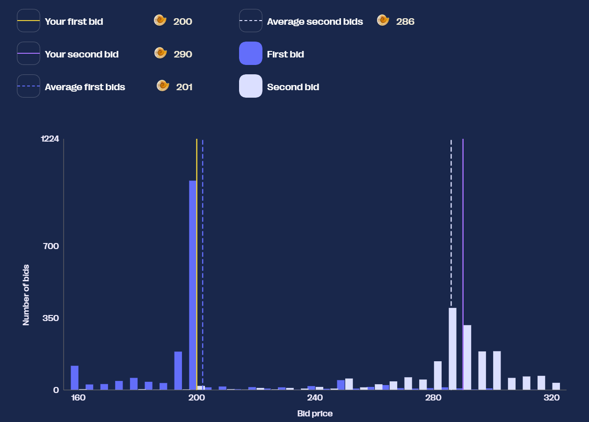
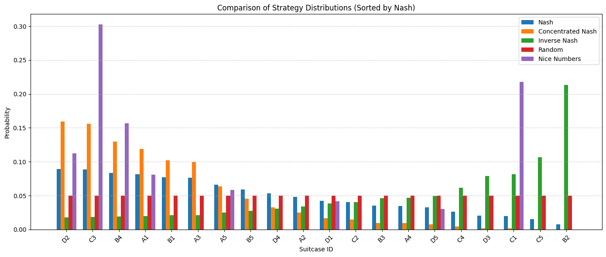

# CMU Physics 🐚🐚🐚 
This repo documents our research, strategy development and tools for **Prosperity 3 (2025)**, with ~12,000 teams we finished 7th Globally & 1st USA.

 

## 📜 What is Prosperity?

Prosperity is a 15-day trading competition where players earn "seashells" to grow their "archipelago" across 5 rounds (each lasting 3 days). Each round introduces new products with unique properties resembling real-world assets; products from previous rounds remain tradable, making it a game of finding alpha and optimizing strategies.

We researched each product using sample data, then wrote and submitted Python scripts to perform systematic trades. Each round also included a manual trading challenge, typically centered around game theory and predicting other participants' decisions.

At the end of each round, both algorithmic and manual results were combined into our island's PNL.

[Prosperity 3 Wiki](https://imc-prosperity.notion.site/Prosperity-3-Wiki-19ee8453a09380529731c4e6fb697ea4)

 

## 👥 The Team
| Chris Berman | [@chrispyroberts](https://github.com/chrispyroberts) |

| Nirav Koley | [@n-kly](https://github.com/n-kly) |

| Aditya Dabeer | [@Aditya-Dabeer](https://github.com/Aditya-Dabeer) |

| Timur Takhtarov | [@timtakcs](https://github.com/timtakcs) | 

 

## 🗂 Repo Structure
Each round has its own folder, containing all our EDA, research, manual trading solutions, and algorithmic strategies.

It started out organized... then the 4 a.m. coding sessions happened. Good luck!

 

## 🧠 What you're probably here for

Here’s a breakdown of our algorithmic and manual strategies. Our overall approach focused on market-neutral plays (straight-line PNL, no crazy bets).

<h2>Round 1</h2>

  
<h3>Algo</h3>

Round 1 introduced 3 new products: Rainforest Resin, Kelp, and Squid Ink. All of these products were relatively distinct but traded like stocks would in the real world -- nothing fancy just an order book and market price.

Round 1 introduced three new products: Rainforest Resin, Kelp, and Squid Ink — all traded like real-world stocks with basic order books and market prices.

- Rainforest Resin was the easiest and most consistent to trade. The fair value hovered around 10,000 seashells with almost no drift ($\pm$4 seashells). We market took anytime bids were above 10,000 or asks below 10,000, and market made inside the spread. Additionally, we exploited standing orders exactly at fair value to better balance our long/short positions, significantly boosting our PNL.

- Kelp was trickier, showing mild drift and volatility. We found a persistent market maker whose mid-price effectively defined the real-time fair value, and confirmed this by submitting an order to buy 1 kelp and holding until the end of the day comparing the final PNL to our buy price. Using this mid-price, we applied the same market making/taking strategy as Resin, without adding any directional bias given the low volatility (~40 seashells over 10,000 steps).

- Squid Ink was pure chaos — with regular 100 seashell swings within a single step and no obvious structure despite IMC’s hints. We tested rolling z-scores, volatility breakouts, and MACD signals without finding any consistent edge. Ultimately, we reused the Kelp/Resin strategy here, but due to random massive price spikes, PNL was extremely volatile. We chose to gamble and submit as-is for Round 1.

<h3>Manual</h3>
  
This manual was pretty simple, it was a currency exchange problem were it was possible to exchange currencies in a way to profit of of it. All we had to do was a breadth first search across all possible currency conversions.

See [Leetcode 3387. Maximize Amount After Two Days of Conversions](https://leetcode.com/problems/maximize-amount-after-two-days-of-conversions/description/).

<h3>Results and Post-Round Analysis</h3>

First-round results were controversial. It became clear the website’s "sample data" was actually the first 1000 timestamps of live day 1 data, allowing teams to hardcode trades. Combined with Squid Ink spiking against our market making position, we initially finished 771st.

After the round was re-run (hardcoding was ruled cheating), we shot up to 9th place with a total PNL of 107,237 seashells (43,243 algo + 44,340 manual). We got lucky on the re-run — Squid Ink spiked in our favor instead of against us. The top 3 teams still finished ~100k seashells ahead of everyone else, but we were within a few thousand seashells of 4th.

Afterward, we decided Squid Ink was too volatile for full-size market making. We adapted by only allocating 10% of our position to it, cutting PNL by about 50%, but added a spike detection system:

- We used a rolling standard deviation on price differences.

- If the rolling std > 20, we fully entered a position opposite to the recent price move.

This adjustment made Squid Ink PNL much more stable across all days.

---

<h2>Round 2</h2>

  
<h3>Algo</h3>
Round 2 introduced new products: **CROISSANTS**, **JAMS**, **DJEMBES**, **PICNIC_BASKET1**, and **PICNIC_BASKET2**.

- **PICNIC_BASKET1** contained 6 Croissants, 3 Jams, and 1 Djembe.

- **PICNIC_BASKET2** contained 4 Croissants and 2 Jams.

We recognized the structure from previous years and analyzed the price difference between each basket and its components. The basket premiums appeared mean-reverting, so we hard-coded the mean from bottle data, used a short rolling window for standard deviation, and calculated rolling z-scores:

- When z-score > 20, we shorted the basket and longed the constituents.

- When z-score < -20, we did the opposite.

This hedging isolated and traded the basket premium directly.

We ran into a problem with this though. The position limits prevented fully hedging both baskets simultaneously. To fix this, we did a few things

- We focused on the difference in basket premiums between Basket 1 and Basket 2.

- When the z-score of (Basket1 premium - Basket2 premium) > 20:

- Short Basket 1, Long Basket 2, then hedge with components accordingly.

Using this strategy used the following of our position limits:

- 100% of Basket 1’s position limit,

- 60% of Basket 2’s limit.

We did z-score trading with the remaining 40% of position limit on Basket 2, but had to limit it to 32% because we couldn't perfectly hedge due to position limits on the constituents. The remaining 8% of Basket 2’s position limit was unused — so we deployed it by market making (taking advantage of ~7–10 seashell spreads).

Overall, this strategy allowed us to fully utilize 100% of allowed position limits while minimizing unhedged risk.
Market making with the leftover 8% added ~5k seashells/day in backtests with very low volatility.

Chris also spotted suspicious trade quantity 15 patterns at highs/lows for Squid Ink and Croissants — hinting at potential price signals. However, it was too late to build a reliable strategy around them, so we planned to revisit this idea in Round 5.

We found that for squid ink and croissants there was always a trade of quantity 15 at the high and low of a given day. This looked like a true signal, the problem was it also incldued many noisy and false signals. Unfortunately we discovered this very close to the end of the round, and didn't have time to write an algorithm that could distinguish true from false signals, so we ended up not using this and decided to wait until round 5 to confirm if this was a true signal or not.

<h3>Manual</h3>

This round’s manual was particularly interesting: we had the choice of selecting up to two out of ten available shipping containers, each with different **multipliers** and **inhabitants**. The key mechanic was that your profit from a container depended not just on the container’s treasure multiplier, but also on how many other players chose the same one:

> **PNL = (10,000 × Multiplier) / (Number of inhabitants + % of total selections that picked this container)**

The first container choice was free, but opening a second cost **50,000 SeaShells**.

We realized fairly early on that this wasn’t just a math problem; it was about simulating player behavior. Containers that were underselected would naturally end up with a higher expected value (EV) than those that looked good initially. At first, we tried writing a basic Monte Carlo simulation where agents simply picked the two containers with the highest immediate EV. This rough model didn’t converge well and ended up giving confusing, unreliable numbers. Looking back, this was the right idea but just poorly executed and didn't have the right goal in mind.

We came up with the idea of estimating the **Nash equilibrium** across the crates, using a similiar but simpler greedy Monte Carlo simulation that aimed to predict the base selection rates for each container. 

When we ran the numbers, we found that the Nash equilibrium values for the containers were consistently **below 50,000 SeaShells**, meaning that opening a second container would almost always be a losing play. From this point on, we decided to only focus on selecting **one container**, believing that hedging across two was too risky given the low payouts.

On top of the Nash equilibrium strategy, we built a set of **priors** based on how we thought players would actually behave, the goal with these assumptions was to try and price in how people might act (beyond just following the nash). These alternative strategies ranged a lot from just random selection to phsycolgoical bias (the number 7 & 3 are well-documented to be more 'likeable' to humans and thus picked more frequently when asked to pick a number from 1-10)  Our hypothesis was that:

- 15% of players would play according to Nash equilibrium,
- 50% would choose randomly,
- 20% would gravitate toward “nice numbers” (multipliers like 73, 17, and 37),
- 10% would misread the prompt and simply pick based on initial EV,
- and 5% would follow the flawed Monte Carlo strategy we had initially come up with.

We re-ran a new Monte Carlo simulation based on these priors and recalculated the EVs of all the containers, aiming to account for both rational and irrational human actors. Ultiamtely we chose to only pick the 80x crate (this was a bad idea).

<h3>Results and Post-Round Analysis</h3>

Once again, these results were quite controversial. Some teams found out that the timestamp in which the bots would trade were exactly the same as the previous year. This meant that teams could predict when buy and sell orders would be filled, and they could take the entire bid/ask of an orderbook out and place their own orders below/above them and have them instnatly be filled, leading to millions in profit per round. This, in our opinion and many others, was unfair and not in the spirit of the challange. While only 2 teams found this (they had millions of seashells at this point), the admins once again decided to disallow this sort of hardcoding, and after reviewing the code of many in the top 25, asked teams who they believed were using this to their advantage to submit versions of their algorithms that did not have this hard coding behavior, ultimately causing them to drop many places on the leaderboard. As for us, we moved up into 7th place with 243,083 seashells, making 102,758 seashells from our algo and 33,087 from the manual.

Looking back on the manual, we definitely **underestimated** how many players would stick close to Nash equilibrium, and **overestimated** the randomness in player behavior. Additionally, our simulation didn’t properly prioritize the impact of the "nice numbers" category, which led us to overweight the chances of truly random selections. Our misjudgments here probably contributed the most to our low overall ranking in the manual component of the tournament. However, it wasn't a total loss — we took the lessons from this round, updated our priors accordingly, and built a much stronger player modeling system for future decision-based rounds.

<h2>Round 3</h2>

<h3>Algo</h3>

This round introduced 6 new products: Volcanic Rocks, and 5 different Volcanic Rock vouchers with strike prices of 9500, 9750, 10000, 10250, and 10500. These products very closely resembled european option contracts, and were set to expire in in 7 in-game trading days. Chris did the analysis for this round, and using the hint provided on the website to modeled the volatility smile by plotting the moneyness $m_t$ agaisnt the implied volatility $v_t$. Moneyness was calculated using the following formula $$m_t = log(K / S_t) / \sqrt(TTE)$$ where $K$ is the voucher strike price, $S_t$ is the price of the underlying at some time $t$, and $TTE$ being the time to expiration in years. 

Fitting a quadtratic to this we found parameters $a, b, c$ for the equation $v_t = a \cdot m_t^2 + b \cdot m_t + c$ allowing us to predict a 'fair' implied volatility for any a given $m_t$. After coding this up, we found the best way to take advantages of this was to code a market maker on this fitted implied volatility. This was an extremely aggressive market maker, and would often cross with the market makers in the orderbook. We also added in functionality to automatically hedge our positions after every timestamp, ensuring that we are only exposed to the implied volatility of a contract. Our backtesting PNL curve was a straight line on most days, indicating that we found a reasonable strategy that is direction-neutral. We hypothesised that this was because we were more accurately modelling the true IV of the vouchers. From our backtests, we were expecting to make ~80k from all voucher products and ~100k from other products.

A few other things we considered this round for algo: 

- Something we considered as part of our analysis was how much we are losing in our long voucher positions due to theta decay. Chris found that the theta decay of the vouchers had a maximum 800 annualized, meaning that holding a voucher for a year, assuming nothing about the underlying or voucher changes, that the value of the voucher would decrease by 800 seashells over the course of the year. So he estimated that the upper bound on how much we would lose due theta decay on a given day if we were fully long 200 of a given voucher was ~430 seashells. (800 seashells per year /  365 days per year * 1 day * 200 vouchers  = ~430 seashells per day per voucher we are fully long). This amount was negligible compared to the 80k we were making on backtests. 

- Since we could hold up to 400 volcanic rocks, and 200 of any voucher, this meant if we went long 2 different vouchers, in the worst case, we could only completely hedge up to 2 vouchers assuming each had a delta of 1. Since we thought that this could get very complicated very quickly, we decided to cap all vouchers at a position size of 80 so we could guarantee that no matter what we would always be fully hedged. This greatly simplified our delta hedging logic, and made it very easy to implement the delta-neutral trading strategy. There is probably a better way to do this, but given the time-constraints of the challange, we thought this was a favorable trade off.

<h3>Manual</h3>
In this round, we had to place **two bids** to acquire **Sea Turtles' Flippers**. Each turtle accepted the **lowest bid above their reserve price**, where reserves were **uniformly distributed** between **160–200** and **250–320**.

For the **second bid**, a penalty applied if your offer was **below the average** of all second bids, scaling your profit by:

> $$ p = \left(\frac{320 – \text{average bid}}{320 – \text{your bid}}\right)^3 $$

All acquired Flippers could later be sold for **320 SeaShells** each.

For this manual, we took a more systematic approach from the start. First, we isolated the **one-bid scenario** and ran a Monte Carlo simulation for every possible bid between 160 and 320.  

From this, we found that if we were limited to only one bid, it was clearly optimal to set it at **200** — just at the cutoff before the dead zone of 200–250.

Next, we tackled the **two-bid scenario**, initially **ignoring** the impact of the *p* scaling (i.e., assuming no penalty for being under the average second bid). We ran another Monte Carlo simulation where the **first bid** was fixed at **200**, and the **second bid** varied across the full range from 160 to 320.  

At this point, it became clear that **picking 285 for the second bid** was the Nash Equilibrium: if all players played optimally (GTO), they would pick **200** first and **~285** second, ensuring their second bid was just above the reserve range and staying above the average.

However, we realized that some players might attempt to **undercut** the average slightly — placing their second bids just above 285 to exploit players who bid exactly at Nash, thereby pushing their bids below the average and subjecting them to the *p* scaling penalty.

To account for this, we built a new set of **priors**, this time using **continuous probability distributions** rather than discrete categories (since bids could be any number within the range). Our assumptions were:

- **10%** of players would play perfect Nash,
- **25%** would concentrate around the optimal mid-point (tight Nash cluster),
- **49%** would pick values **slightly higher than the GTO price**,
- **1%** would pick completely randomly,
- **15%** would intentionally grief (e.g., bots setting bids at 160 or 320 to skew the distribution, as discussed in Discord).

We then modeled these priors and re-simulated outcomes, finding that the **optimal second bid** was approximately **290** — slightly higher than the GTO point to hedge against players trying to outmaneuver Nash bidders.
 

<h3>Results and Post-Round Analyysis</h3>

The manual of this roudn turned out not so decent. The **actual average** second bid ended up being around **286**, slightly higher than pure GTO but very much in line with our expectations. Looking at the resulting graphs, it was clear that most players aimed for Nash or slightly above it, confirming that our modeling approach and priors were pretty spot-on.

Overall though, this round was absolutely brutal for us as we fell from 7th to 241st, making us all believe that a comeback was impossible. We only made 75,755 on algo while many of the top teams made >200k on algo. We knew either something was wrong or we had missed something.

- We first realized Jasper's visualizer, which we were using extensively, was having some issue where it would cause the algorithm on submission to use more than 100mb of memory, causing the AWS lambda instance to restart. This meant all local variables that our algorithm was using to trade would be wiped and re-initialized. This was a problem for our rolling windows which were important for trade entries and hedges on basket and volcanic rock products, and caused our trader to effectively buy and sell these products randomly. In future submissions, we decided to remove Jasper's visualizer on our final submission to avoid this issue rather than debug it. 

- Chris then realized we completely missed an extremely profitable trading strategy on volcanic vouchers. The issue was that our quadratic fit for implied volatility stopped being a good model on the submission day, and our model would either severely under or over estimate the IV the market was trading at. This meant our trader effectively would enter into a long / short position on IV for a voucher and stay in that position for the whole day. While the IV on the vouchers did spike, the amount of seashells this IV spike corresponded to was very little, so we pretty much made nothing from volcanic rocks by using our fitted model. In the figure below, Chris plotted the IV for bids and asks on different vouchers across time, along with a short rolling window of the mid IV. Using the mean of this rollowing window instead of our quadtratic fit as a model for the fair IV made our backtester PNL shoot up from 80k to 150k on every single day, including the day of submission.

- Chris then also ran some backtests to figure out how much our hedge cost us. Since the orderbook for volcanic rock had a consistent spread of 1, every buy/sell effectively cost us 0.5 seashells. By counting the total trades we took while hedging out position, Chris found that we were paying over 40k in spread just to hedge our position. This gave us the idea that we might not want to hedge our position.

- Chris estimated an upper-bound for how much we could lose due to being unhedged. At one point in the day, volcanic rocks moved by 100 seashells in a single step, which assuming a delta of 1, would correspond to a maximum loss of 40k if we were holding 400 vouchers. Chris tracked the average delta we were exposed to throughout the day, and found that it was almost always as if we were long 160 of the underlying, meaning Chris' estimate was a very high upper bound, and a more realistic guess was a potential maximum loss of 16k in a single step. We decided that because to price movement appears random (at least to us) and the potential upside of not hedging was greater than our realistic expectation of maximum drawdown (40k > 16k), combined with our hypothesis that in expectation the net loss is 0, that going unhedged would be a risk worth taking. This boosted our backtester PNL on all volcanic rock products to 250k per day.

<h2>Round 4</h2>

 

After the dissapointing algo results in round 3, we felt defeated and were honestly ready to give up. Breaking into the top 25, let alone the top 10, seemed impossible from this position. Luckily, in Chris' opinion, this round was incredibly easy, as it was very similar to round 2 last year, and his trading algo last year landed him in 3rd place that round, so he was confident that re-implementing his strategy from last year would net good results. 
  
<h3>Algo</h3>
This round introduced a new product called Magnificent Macrons. Magnificent Macrons can be bought or sold on the local island and then converted on the Pristine Island (thinking buying BTC from one crypto exchange then selling it on another, same exact concept). However, when converting your position, you pay fees, which include a transport cost, an export tariff, which is paid if you convert a long position (think exporting from main island) or an import tariff (think importing to main island). In addition to this, you pay a storage fee of 0.1 seashells per timestamp per Macron you hold, heavily encouraging you to never hold long positions. While the price movements of Macron are strongly correlated with sugarPrice and sunlightIndex, we decided to completely ignore this, as simply arbitraging across islands was far more profitable than predicting the movements Macron's using a model. 

- Because import tariffs were negative, we were paid to sell on the local island and convert on the Pristine island. To calculate the price needed to sell a Macron for to break even after converting, we used the following formula: sell_local_break_even_price = conversion_ask + import_tariff + transport_fee.

- We also noticed that there was a bot agressively taking orders on our local island around the mid price of the Pristine island. We used this to our advantage by placing sell orders near this mid price if it was above our break even price, and immediately converting them after they were filled. We would pocket the difference between how much we sold it for and our break even price, multiplied by 10 because we could convert 10 at a time.

- In backtests, Chris estimated a potential profit of up to 100k on Macrons over the course of the day depending on how negative import tariffs were. We were happy with this so submitted and went to bed. 

BLAH BLAH BLAH
<h3>Manual</h3>

In this round, players could open up to **three suitcases** containing prizes. Opening one suitcase was free, but opening a second or third required paying a fixed cost. 

Each suitcase had a **prize multiplier** (up to 100) and a known number of **inhabitants** already selecting it. Profit was calculated as:

> **Profit = (10,000 × Multiplier) ÷ (Number of inhabitants + % of global suitcase selections)**

Costs for opening additional suitcases applied after this division, making careful suitcase selection critical.

This challenge was nearly identical to Round 2, giving us a shot at redemption. We started strong by immediately calculating the **Nash equilibrium** across all suitcases.  

Since the Nash EV was **greater than 50,000** (the cost of opening a second suitcase), we determined it was profitable to **open two suitcases**.

The real challenge came in **modeling human behavior**. Fortunately, players had shared post-analysis from Round 2 on Discord, showing how actual picks compared to Nash predictions.  

The findings were surprising:
- **Way more players** picked close to Nash than we had expected.
- There was **massive buy pressure** on "nice numbers" like **17** and **73**, confirming our human psychology prior.
- Minor deviations elsewhere seemed due to random noise.

Based on this, we simplified and updated our priors:
- **50–60%** of players would pick according to Nash distribution.
- **5–15%** would concentrate on the most selected parts of Nash.
- **5–10%** would favor the least selected parts (based on over-correcting from last round’s profitable crates).
- **10–15%** would pick randomly.
- **10–15%** would favor "nice numbers" based on human psychology.

Rather than running another Monte Carlo simulation (since this was a discrete problem), we created a **probability distribution** directly across all suitcases. We multiplied base Nash probabilities by the expected deviations from our priors to estimate suitcase popularity mathematically.  
 
 

Using this model, we selected **suitcases 83 and 47** as our picks.
 

<h3>Results and Post-Round Analysis</h3>

We woke up to a very pleasant suprise. We were back in 8th! Out of all teams this round, we had the highest PNL, making a whopping 447,251 from our algo and manual! We realized that had we not messed up round 3, we would be in second. We also realized based on our algo PNL that we had a very similar trading strategies to #1 (Frankfurt Hedgehogs), making 20k on them while having a very straight PNL curve. This combined with the fact that Chris found in backtests on the submission for round 3 that our algo PNL was again very similar to #1, pretty much confirmed that we had the same trading strategies but potentially slightly better. We had a real stop of making the top 2, or maybe even top 1, and were incredibly motivated.

This manual went **extremely well** for us. While we didn’t absolutely maximize profits, our approach paid off — our predicted densities were **very close to the actual results**, leading to strong EV predictions and a solid gain in ranking.  
*(Insert predicted vs actual densities/EVs picture.)*

After our emotions settled, Chris ran some backtests on Macron arbing and confirmed that around 100k of our PNL came from Macrons. He also found out that out of the 10,000 steps in the submission, we only traded 56,000 macrons. Because we only sent orders in sizes of 10, we estiamted that we were only trading about half the time. Because the import tariffs were very negative, we were making ~3 seashells per Macron we arbed, and so by not trading on 4,400 timesteps, we effectively left 44,000 macrons on the table, meaning we potentially left 132k seashells on the table. Chris reasoned that sometimes the aggressive buyer of Macrons would sometimes not be there, and so we would want to have a small stockpile of Macrons that we are always short for timesteps where we don't get to sell. By simply ensuring that we always sold up to 30 instead 10, we traded 95,000 macrons. This however would lead to a net short position the entire day, which we estiamted could potentially lead to a loss of 30 * 400 = 12,000 seashells if price moved agaisnt us (the 400 number being the largest price movement we observed in the data). Given that we were almost doubling the amount of Macrons we were arbing and hence doubling our PNL, we decided this risk was worth taking,

---

<h2>Round 5</h2>

 
  
<h3>Algo</h3>
This round no new products were introduced. Instead, we were told the counterparties that we were trading agaisnt. Specifically, there were 11 other bots trading the same products we were. We started by visualizing all trading activity for all the bots, and plotted products prices and overlayed a scatter plot with the prices bots would trade at. We did this for all bots and all products, and quickly found that one bot, 'Olivia', would buy/sell and the low/high of the day every day on 3 different products.

Chris had correctly guessed that the trades present in round 2 data did indeed have a true signal. Using this information, we planned to update our algorithms to copy Olivia's trades.

- After running some quick tests, we found that we were making more just market making and taking on kelp than using Olivia's signal, so we left our Kelp trading alone.

- For Squid Ink, we decided to market make and take with maximum position sizing until Olivia's signal, and then just follow it for the rest of the day.

- Croissants was slightly more complicated because we were using it as a hedge in our basket trades. We estimated that we were making ~30k per day by doing statistical arbitrage on the basket premiums. Because we had a true signal on croissants, Chris reasoned that we shouldn't take trades on baskets in the opposite direction of Olivia's signal, as the price of Croissants accounted for ~50% of the price of the basket.

  
- Building off this, we decided to YOLO into Croissants. Our maximum position size for Croissants was 250, but if we went long on both baskets, we could effectively be long 1050 Croissants. We estimated that on a bad trading day for this signal, the difference between the high and low on Croissants is 40 seashells, so a lower bound on our croissants PNL was 40 * our position size. Going long an extra 800 Croissants on this bad day will give us an extra 32k Seashells.

- Our statistical basket arbitrage was hitting 50k on it's best days, while YOLOing croissaints on Olivia's signal was getting up to 120k on its best day (difference of about ~120 between the high and low). We decided this was the best idea. Convinient that it was also very simple to implement.

- We hedged the baskets by going opposite on Jams and Djembes, as the movement of the basket was still about 50% correlated with these products. Our final position ended up being exposed to 30 Jams due to position limits. By taking on the extra 30 jams, we were able to go long another 60 croissants. We found that Jams would move on average 50 on their most volatile day, so the upside of the 60 Croissants was higher than the potential downside on Jams leading us to believe that this was a risk worth taking.

- We also realized we were exposed to the premium of the basket, and that in a near worst-case scenario, we could lose up to 300 seashells per basket we were holding if we bought at the top of premium then sold at the bottom or vice versa, meaning a total potential loss of up to 45,000 seashells due to premium movement agaisnt us while in our trade. We could not think of a way to reduce this risk.

- Chris found that with 90% confidence the difference in basket 2 premiums from one timestep to the next was stationary, and with 95% confidence for basket 1, so we reasoned that its a coinflip that premium will move agaisnt us, and the probability of us buying right as the series is mean reverting is incredibly low (assuming Olivia's signal is not correlated with the top/bottom of premiums). Because of this, we reasoned that our potential loss is most likely not 45,000 and more realistically 20,000 at most, and that in expectation our loss is 0. Based on this line of reasoning, we ultimately decided that this risk was worth taking. 

- One final optimization Chris made was that while waiting for Olivia's signal, we would market make and take on both picnic baskets since they both had large spreads. This made us an 10k seashells per day depending on how long we had to wait before Olivia's signal. 

<h3>Manual</h3>

For this round, we had to trade on 9 different products and derive sentiments from the 'goldberg' terminal. Trading was not only influenced by **sentiment**, but also incurred increasing **fees** based on how much of each product was purchased:

> **Fee(x) = 120 × x²**, where *x* is the portfolio allocation fraction.

This made optimizing both **selection** and **sizing** critical to maximize profits.

At first, this round seemed purely **vibe-based**. However, after some thought, we realized it was actually a **portfolio optimization** problem in disguise.

The first step was to generate **priors** for how each product's price might move.  
Luckily, we found data online from previous years, and noticed that the tradeable products were almost **identical** to those offered this year. This allowed us to **map historical returns** onto current products. 

However, the instructions were vague — it was unclear whether price movements were **purely player-driven** or **predetermined**. To be cautious:
- We **adjusted** last year’s return data slightly based on **sentiment from Discord** and our **own intuition**.
- We used historical data mostly to **estimate the range of possible movements** rather than directly copying past results.
 

Once we had reasonable return estimates, we tackled the portfolio allocation. With **9 products** and the **quadratic fee structure**, it was clear that naive brute-force (e.g., a grid search) would be computationally impossible.

Instead, we used **convex optimization** (`cvxpy`) to solve for the **optimal portfolio allocation**, maximizing expected returns while minimizing fee penalties.
 

We also decided to **tone down** the allocation weights slightly for higher-risk products to **mitigate the chance of getting burned** if our return estimates were wrong.

 

<h3>Results & Post-Round Analysis</h3>
We finished 7th! and 1st in the US! We we really happy with this result. Our algo made 244,740 seashells and we made 138,274 on manual. Frankfurt, who we knew with high probability had a very similar strategy to us, made a similar amount. Heisenberg, the #1 team, made more than 800k on algo this round! We still have no idea how he did this, but Kudos to them for figuring out something that no other team could! 

Overall, for manual we played this round **a bit too safe**. While our returns were solid, we left potential profits on the table by not being aggressive enough in our allocations. Additionally, it turned out that **player behavior had a major impact** on price movements — some products (like Red Flags) moved far more than historical data suggested, likely due to heavy player sentiment. While it wasn’t our strongest manual, we stuck to a disciplined strategy and don’t regret the decision to prioritize **risk management** over gambling for bigger wins.

Chris, after talking with Jasper about his algo on the last round, realized that z-score based strategies on Volcanic rocks performed really well across all days in backtests. Using Jasper's volcanic rock z-score trading logic, and using the same hyperparameters, we were able to make an extra 150k per day by trading volcanic rocks, a product we decided not to trade at all. However, we were still unsure if this was truly an edge-generating strategy or just very lucky, because small tweaks to the hyperparameters or implementation would lead to wildly different backtesting results, some often being very negative in PNL. With the risk-averse approach that we took throughout the competition, we weren't that unhappy about missing this potential edge, as we weren't absolutely convinced that it would work in the long run given static parameters. 

---

## 🏁 Final Thoughts

As teammates, we had never spoke with each other before the challange, and were connected through a mutual friend that Chris particiapted with the previous year. After spending many long nights together, often staying up until 6am discussing anything from squid ink price dynamics to the volatility smile of volcanic rocks option chain, we emerged as close friends and top 10 winners of Prosperity 3, even though Chris didn't know Fumble's real name until he made his LinkedIn post.

While we didn't win any money, making the top 10 after having our rank change more than squid ink would in a day is something that we are proud of. We did make a few small mistakes which ended up costing us what we believe would have been a top 5 global ranking. Regardless, we learned a lot about game theory, options trading and statistical modelling
and are incredibly thankful to IMC for hosting the challange, the discord moderaters for being very pleasant and providing useful hints, and Jasper for his open source visualization, backtester, and leaderboard. 

